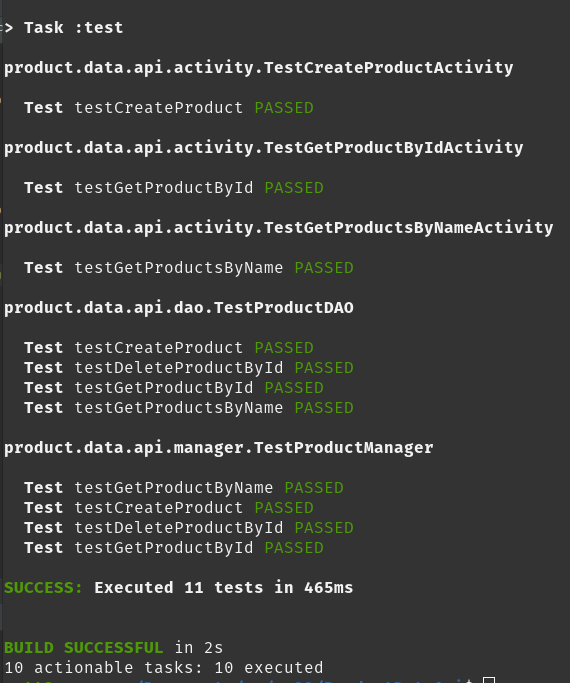

# Product Data Api

## Product Fields
```
Long productId
String productName
String productDescription
```

# Product Endpoints

## /createProduct
Url Params:
``` 
String productName
String productDescription
```
```
http://{ip}:{port}/createProduct?productName=product1&productDescription=This%20is%20a%20product%20description
```

**As shown above, the urlParams must be urlEncoded**

## /getProductById
Url Params:
```
Long productId
```

```
http://{ip}:{port}/getProductById?productId=1
```

## /getProductsByName
Url Params:
```
String productName
```

```
http://{ip}:{port}/getProductsByName?productName=productName1
```

## /deleteProductById
Url Params:
```
Long productId
```

```
http://{ip}:{port}/deleteProductById?productId=1
```

# Need to update fields in application.properties or specify them as environment variables
```
server.port=${port}
spring.data.jpa.repositories.enabled=true
spring.jpa.hibernate.ddl-auto=create-drop
spring.datasource.url=${databaseUrl}
spring.datasource.username=${dbUsername}
spring.datasource.password=${dbPassword}
spring.jpa.database-platform=org.hibernate.dialect.MySQL8Dialect
spring.jackson.serialization.indent_output=true
```


# How to build
chmod +x gradlew
./gradlew build

# How to clean and rerun tests / rebuild
./gradlew clean
+
./gradlew tests
or
./gradlew build

